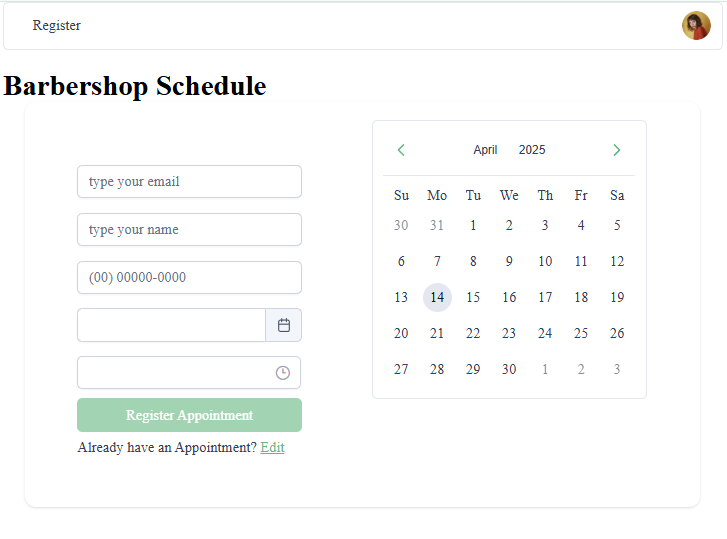
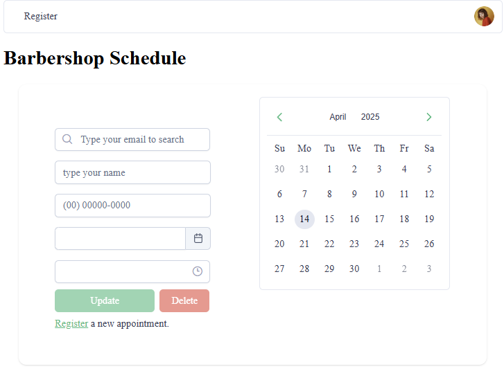
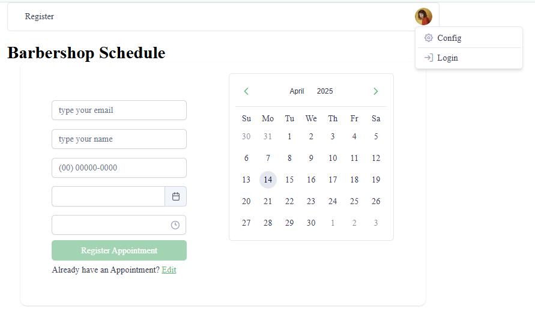
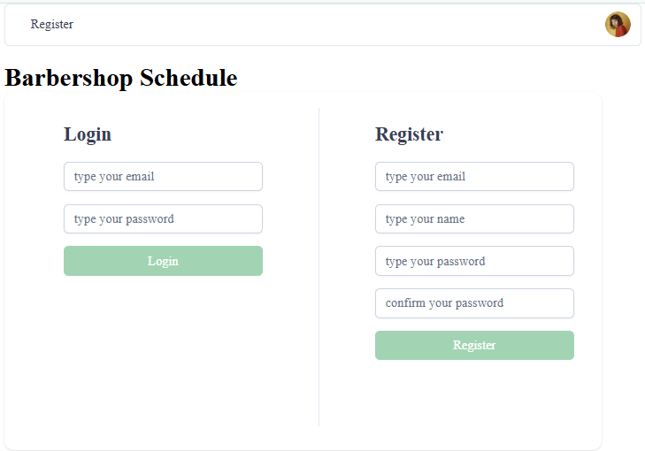
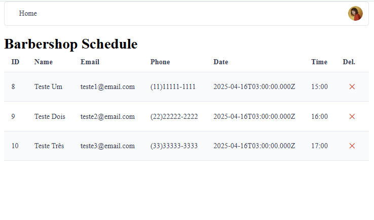

# Barbershop Schedule

Este projeto simula um aplicativo de agendamento de horários em uma barbearia.

## Stack

 - Angular
 - Java (Spring Boot)
 - PostgreSQL

## 🔧 Como Executar o Projeto

### 1. Clonar o Repositório
```
git clone https://github.com/Vinigg/barbershop-schedule.git
cd barbershop-schedule
```

### 2. Instalar o Angular CLI e Dependências
Caso ainda não tenha o Angular CLI instalado, execute:

```
npm install -g @angular/cli
```
Agora, instale as dependências do projeto com o comando:

```
npm install 
```
### 3. Iniciar o Servidor Angular
Para rodar o projeto, execute o seguinte comando:

```
ng serve
```

Acesse pelo navegador no endereço: `http://localhost:4200/`


## Páginas

### Register

A página simula a interação do cliente, onde ele informa seus dados e escolhe um dia e horário para cadastro.

<div align="center">
    
 </div>

### Update

Ao clickar em "Edit" na página de marcação, o cliente será redirecionado para uma tela onde poderá buscar por um horário já reservado.

Caso um horário seja encontrado ele será carregado na tela, o cliente poderá atualizar as informações ou deleta-lo. 

<div align="center">
    
 </div>


### Login

Um admnistrador poderá efetuar o login em sua conta através do ícone de usuário, ou acessando a rota com final `/login` 

<div align="center">
    
    <br>
    <span>Ao clickar no botão login</span>
    
 </div>


### Appointments

Depois do usuario efetuar o login, a tabela com todas as marcações será disponibilizada na tela.

<div align="center">
    
 </div>


🚀 Este projeto foi criado como parte do Decola Tech Avanade 2025
